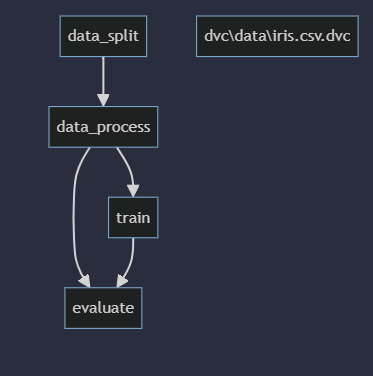

Data version control

<b>Primary focus was on learning DVC and DVC pipeline</b>
- This project is on a very small dataset which is iris dataset.

<b>What is DVC ?</b>
- In our machine learning experiments, we do a lot of cleaning, transforming on our original dataset and   try the transformed data on a particular algorithm.

- So, in this process until we don't get a good model, we keep changing our data and also models and sometimes it is hard to keep track of them.

- Here comes DVC which keeps track of data, parameters we use and the model, it is just like Git, where we keep track of our code.

I created Python scripts which is under dvc/src/
This folder consists of data_split, data_process, train, evaluate python scripts.

I created a params yaml file which consists of parameters used for splitting the data, processing it and train and evaluate it. Passing this file's key, value to the Python scripts makes easy to run pipeline.
Change in params file reflects on all scripts.

<b>DVC yaml file </b>
This file is important for running the pipeline using dvc repro command.
This file consists of different steps in stage --> example here,
We first split the data, then we process it, train it and evaluate, these steps are done one-by-one.

<b>DVC Commands</b>

1] dvc init --> initializes dvc, a creates some files in .dvc folder
             Here is one file config in which you need to give a remote storage where it keeps the file
             I used my local to store, you can use any other cloud storage.

2] dvc remote add -d name_of_folder path_to_storage.

3] dvc add file_path --> this adds the file to dvc tracking list also it will tell git to not track this since dvc it doing it by adding a .gitignore file

4] dvc commit --> just like git commit

5] dvc push --> it pushes changes to your remote storage

It can also track metrics of the model

6] dvc metrics show --> shows you the metrics

7] dvc metrics diff --> tells you the difference 

It also has DAG (Direct acyclic graph) --> which tells you the relationship and dependencies in the pipelines.
